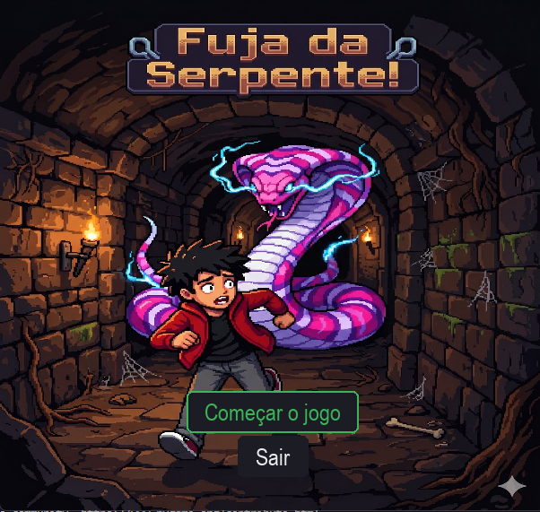
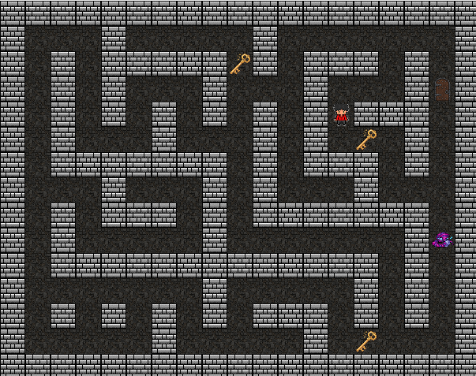
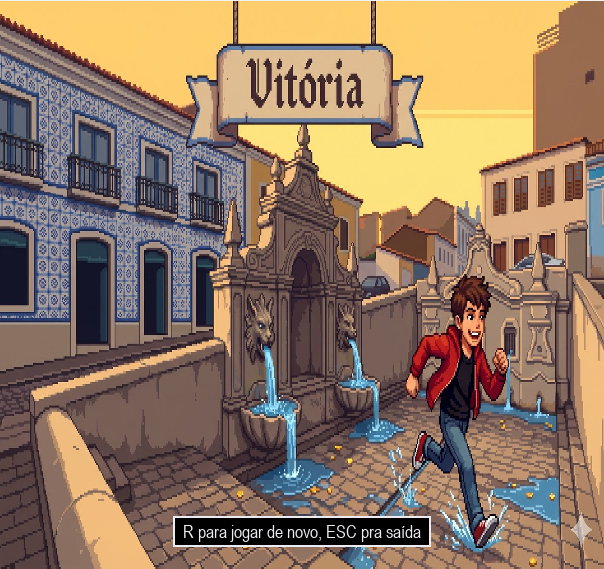
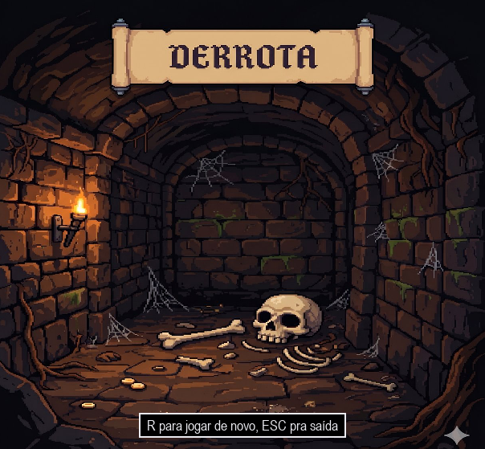

# 🐍 Fuja da Serpente

Jogo feito em Python com Pygame para o trabalho de conclusão da disciplina **Algoritmos I**.

Você estava se aventurando pelas ruas do Centro Histórico de São Luís quando, ao passar pela Fonte do Ribeirão, pisa em umas tábuas podres e quando percebe, cai em um buraco. Ao se recuperar, nota que está em uma espécie de labirinto subterrâneo. Rapidamente, você percebe que não está sozinho. Tem 3 chaves escondidas por aí, mas só uma abre a porta de saída, e um filhote da Grande Serpente de São Luís está vindo te caçar, usando busca **A\*** pra nunca perder seu rastro.

---

## 🎮 Como jogar

| Tecla | Ação |
|---|---|
| `W` `A` `S` `D` ou setas | Mover o personagem |
| `Enter` / `Espaço` | Confirmar opção no menu |
| `R` | Jogar de novo (na tela de vitória ou derrota) |
| `Esc` | Sair do jogo |

**Objetivo:** Ande pelo labirinto, pegue uma chave e leve até a porta. Se for a chave certa, você vence. Se for a errada, ela se perde e você precisa achar outra, então pense bem antes de testar. Enquanto isso, a serpente está sempre a um passo atrás, recalculando o caminho mais curto até você.

Você só carrega **uma chave por vez**.

---

## 🧠 A ideia por trás da serpente

A serpente não anda por sorte. A cada passo ela roda uma busca **A\*** a partir da própria posição até a posição atual do jogador, usando a **distância de Manhattan** como heurística (já que o movimento é só em 4 direções, sem diagonal).

Isso significa que ela:
- sempre encontra o caminho mais curto possível pelo labirinto;
- recalcula esse caminho do zero a cada novo passo, porque o jogador também está se movendo;
- nunca atravessa parede — ela respeita exatamente as mesmas regras de colisão do jogador.

A movimentação da serpente é controlada por tempo real (milissegundos), não por contagem de frames — assim a velocidade dela não muda dependendo do desempenho da máquina que está rodando o jogo.

---

## 📁 Estrutura do projeto

```
.
├── fuja_da_serpente.py
└── assets/
    ├── imagens/
    │   ├── parede.png, caminho.png
    │   ├── jogador_cima.png, jogador_baixo.png, jogador_esquerda.png, jogador_direita.png
    │   ├── chave.png, porta.png, serpente.png
    │   └── menu_fundo.jpg, vitoria.jpg, derrota.jpg
    └── sons/
        ├── coleta_chave.mp3, chave_falsa.ogg
        ├── vitoria.ogg, derrota.wav
        └── musica.ogg
```

---
 
## 📸 Screenshots
 
| Menu | Partida em andamento |
|---|---|
|  |  |
 
| Vitória | Derrota |
|---|---|
|  |  |
 
---


## ⚙️ Como rodar

**Pré-requisito:** Python 3 instalado.

```bash
pip install pygame
python fuja_da_serpente.py
```

Garanta que a pasta `assets/` esteja no mesmo diretório do arquivo `.py` — o jogo carrega as imagens e sons a partir de caminhos relativos a ela.

---

## 🛠️ Detalhes técnicos

- **Mapa:** uma matriz simples de texto (`#` = parede, espaço = caminho), pensada e testada manualmente pra garantir que todo ponto livre é alcançável a partir de qualquer outro.
- **Grid lógico vs. pixel:** toda a lógica do jogo (movimento, colisão, busca de caminho) trabalha em coordenadas de grid (linha, coluna). A conversão pra pixel na tela só acontece na hora de desenhar.
- **Máquina de estados:** o jogo tem 4 estados (`menu`, `jogando`, `vitoria`, `derrota`), e cada tecla só é processada se fizer sentido no estado atual.
- **Sorteio sem sobreposição:** jogador, chaves, porta e serpente nascem em posições aleatórias do mapa, mas nunca na mesma célula — cada posição sorteada é guardada num conjunto de posições já ocupadas antes da próxima entidade ser posicionada.

---

## Ideias de melhorias:
- Planejo futuramente em implementar uma maneira de gerar mapas de labirintos aleatórios. Tentei fazer isso mas sempre gerava labirintos que não tinham saída ou trancavam o jogador ou a serpente. Talvez criarei labirintos na mão mesmo e farei com que o jogo os escolha aleatoriamente.
- Planejo dificultar um pouco mais o jogo ao adicionar mais serpentes ou propriedades nas serpentes (como serpente cega) ou no mapa (como água e terra, com valores diferenes de velocidade de movimento) ou blocos especiais (rachaduras ou buracos na parede em que a serpente pode se enfiar e 'atravessar' a parede).
- Planejo adicionar um Boss final, a Grande Serpente de São Luís, que terá um corpo de vários pixels (Parecido com o jogo da cobrinha tradicional) e o jogador deverá tomar cuidado para não se prendeer com ela no labirinto e não encostar no seu corpo.

## 📄 Licença

Este projeto está sob a licença MIT — veja o arquivo `LICENSE`.